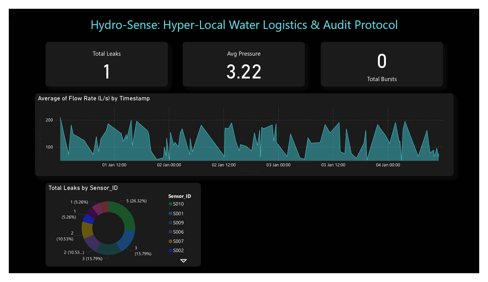

# Hydro-Sense: Hyper-Local Water Logistics & Audit Protocol

## 📊 Project Overview
This project focuses on the visual analytics layer of the **Hydro-Sense** protocol. It transforms raw IoT sensor telemetry into an interactive, real-time control center designed for urban water management.

## 🛠️ Tech Stack & Skills
* **Tool:** Power BI Desktop
* **Data Modeling:** Star Schema, CALENDARAUTO()
* **Analytics:** DAX (Data Analysis Expressions) for custom KPIs
* **Domain:** IoT, Smart City Infrastructure, Water Logistics

## 💡 Key Features
* **Real-Time Monitoring:** Visualizes flow rate (L/s) and pressure (bar) fluctuations across 1,000+ data points.
* **Leak & Burst Detection:** Intelligent DAX measures that trigger alerts for system failures.
* **Geospatial Insights:** Breakdown of leak events by specific Sensor IDs to pinpoint infrastructure vulnerabilities.
* **Professional UI:** Sleek dark-mode interface designed for high-stakes operational environments.

## 📸 Dashboard Preview

## 📁 How to View
* **[Download the PDF Report](./Hyper-Local Water Logistics & Audit Protocol.pdf)** for a high-resolution look at the analytics.
* **Data Source:** Based on real-world IoT sensor leakage datasets from Kaggle.
